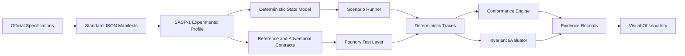

# SPECTRA

## Cross-Standard Asset Protocol Security Observatory

> An executable and visual research laboratory for analyzing token-standard semantics, interoperability failures, settlement risks, protocol invariants, and adversarial state transitions across blockchain ecosystems.

**Repository:** `spectra-asset-protocol-lab`
**Status:** Day 0 — repository scaffold and specification phase
**Project type:** Independent protocol-security research laboratory

---

## Research Question

Can the transfer, approval, authorization, supply, event, precision, and cross-chain behaviors of different blockchain asset standards be expressed under a shared executable model, so that security and financial-settlement inconsistencies can be detected before integration?

SPECTRA investigates this question through machine-readable specifications, deterministic state transitions, adversarial execution traces, invariant testing, conformance analysis, and evidence-driven visualizations.

---

## Scope

The initial comparative scope is limited to fungible-asset semantics across:

* Ethereum ERC-20
* TRON TRC-20
* BNB Smart Chain BEP-20
* Algorand ARC-200

The project also introduces:

### SASP-1

**Secure Asset Semantics Profile — Experimental Draft**

SASP-1 is a research-grade experimental profile intended to extract security-critical asset behavior into a deterministic, testable, and machine-readable specification.

SASP-1 is not an official standard, an industry proposal, or a production-ready token specification.

---

## Explicit Non-Goals

SPECTRA does not claim to:

* introduce a production-ready token standard;
* provide a complete audit of ERC-20, TRC-20, BEP-20, or ARC-200;
* implement a production bridge;
* formally verify every component;
* prove that an implementation is vulnerability-free;
* provide a trading strategy;
* replace official protocol specifications.

The project is designed as a small, reproducible research laboratory focused on behavioral correctness and security evidence.

---

## Frozen MVP

The seven-day MVP is limited to:

1. Four source-backed standard manifests.
2. One experimental SASP-1 manifest.
3. One deterministic TypeScript state-transition model.
4. One minimal ERC-20-compatible reference implementation.
5. Deliberately non-compliant and secured contract variants.
6. Four adversarial scenarios:

   * allowance state race;
   * non-standard transfer semantics;
   * precision and settlement divergence;
   * cross-chain supply violation.
7. Eight explicitly defined security invariants.
8. Vulnerable-versus-secured execution comparisons.
9. Trace-driven technical visualizations.

Live-chain deployment, complete ARC-200 implementation, production bridge integration, heavy formal-verification tooling, and broad protocol coverage are outside the MVP.

---

## System Architecture



---

## Planned Security Invariants

The initial model will define and test:

* **INV-01 — Supply Conservation**
* **INV-02 — Balance Conservation**
* **INV-03 — Authorization Integrity**
* **INV-04 — Allowance Safety**
* **INV-05 — Event–State Consistency**
* **INV-06 — Replay Uniqueness**
* **INV-07 — Settlement Consistency**
* **INV-08 — Deterministic Replay**

Each invariant will eventually include:

* a natural-language definition;
* a mathematical definition;
* dependent state variables;
* violating scenarios;
* executable test mappings;
* trace evidence;
* visual representation.

---

## Evidence Model

A security or conformance claim is accepted only when it can be connected to one or more concrete artifacts:

```text
Specification Requirement
        ↓
State Transition or Contract Behavior
        ↓
Test or Adversarial Scenario
        ↓
Deterministic Execution Trace
        ↓
Invariant or Conformance Result
        ↓
Human-Readable Visualization
```

Static-analysis output may be used as supporting evidence, but it will not be treated as a security proof.

---

## Repository Structure

Current Day 0 structure:

```text
spectra-asset-protocol-lab/
├── docs/
│   └── README.md
├── standards/
│   └── README.md
├── .gitignore
└── README.md
```

Additional directories will be introduced only when they contain real project artifacts.

Planned later-stage directories include:

```text
contracts/
test/
model/
traces/
frontend/
scripts/
```

---

## Research and Engineering Principles

* Official and primary sources take precedence over secondary summaries.
* Similar interface names must not be treated as proof of equivalent semantics.
* Every important state transition must define its preconditions and postconditions.
* Security findings must identify measurable technical impact.
* Visualizations must be generated from real manifests, tests, or execution traces.
* Vulnerable and secured implementations must be evaluated with equivalent inputs.
* Deterministic replay must produce the same final-state hash for the same ordered input set.
* Limitations and unsupported claims must remain visible.

---

## Planned Documentation

The project will progressively produce:

* `docs/specification.md`
* `docs/threat-model.md`
* `docs/invariants.md`
* `docs/methodology.md`
* `docs/findings.md`
* `docs/limitations.md`

These documents will be added only when their first substantive content exists.

---

## Current Reproducibility Status

The repository currently contains only the initial research scaffold.

Build, test, replay, visualization, and validation commands will be documented after the corresponding executable components are introduced.

---

## Author

**Valerius VARDA**

Research interests include protocol engineering, blockchain security, financial infrastructure, deterministic systems, and adversarial testing.
# SPECTRA Documentation

This directory contains the human-readable research specifications, security
models, evidence rules, findings, and limitations used by SPECTRA.

## Current Documents

| Document         | Status                       | Purpose                                                                                       |
| ---------------- | ---------------------------- | --------------------------------------------------------------------------------------------- |
| `state-model.md` | Working Specification v0.1.0 | Defines the state boundary, transition model, reachability rules, and foundational invariants |

## Planned Documents

The following documents will be introduced only when they contain substantive
and reviewable material:

| Document               | Intended Purpose                                                    |
| ---------------------- | ------------------------------------------------------------------- |
| `project-charter.md`   | Frozen scope, research question, non-goals, and acceptance criteria |
| `architecture.md`      | Components, data flow, and trust boundaries                         |
| `methodology.md`       | Research, test, trace, and evidence-generation method               |
| `threat-model.md`      | Assets, actors, adversaries, trust boundaries, and abuse cases      |
| `invariants.md`        | Versioned invariant definitions and executable mappings             |
| `findings.md`          | Source-backed and test-backed research findings                     |
| `limitations.md`       | Unsupported claims, exclusions, and unresolved risks                |
| `evidence-register.md` | Claim-to-source, test, trace, and visualization mappings            |

## Documentation Status

A document may use one of the following statuses:

* **Draft** — structurally incomplete or under initial development;
* **Working Specification** — complete enough to guide implementation but
  still subject to test-driven revision;
* **Candidate** — reviewed against its required evidence;
* **Accepted** — approved for the current project version;
* **Superseded** — replaced by a later version.

## Evidence Rule

Every material technical claim must be connected to one or more of the
following:

* an official specification;
* an explicit state-machine definition;
* an implementation;
* an executable test;
* an adversarial trace;
* a measurement;
* a reproducible evidence record.

Events, transaction statuses, assertions, static-analysis warnings, and visual
outputs are supporting evidence. None is treated as an independent proof of
security.

