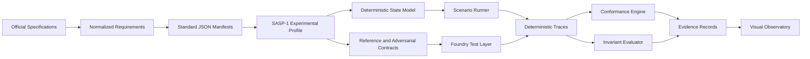

# SPECTRA

## Cross-Standard Asset Protocol Security Observatory

> An executable and evidence-driven research laboratory for analyzing
> asset-standard semantics, protocol invariants, interoperability failures,
> and financial-settlement risks across blockchain ecosystems.

**Repository:** `spectra-asset-protocol-lab`
**Current phase:** Research foundation and executable-model preparation
**Project type:** Independent protocol-security and financial-infrastructure research laboratory
**Primary language:** English
**Status:** Experimental and under active development

---

## 1. Executive Summary

SPECTRA is an independent research and engineering project for studying how
fungible-asset standards behave across different blockchain ecosystems.

The project focuses on a central problem:

> Similar interfaces do not necessarily imply equivalent execution,
> authorization, accounting, failure, event, or settlement behavior.

SPECTRA will transform official standard requirements into:

* normalized machine-readable manifests;
* explicit state-transition models;
* executable protocol scenarios;
* adversarial contract variants;
* security invariant evaluations;
* deterministic execution traces;
* conformance evidence;
* technical visualizations.

The initial comparative scope covers:

* Ethereum ERC-20;
* TRON TRC-20;
* BNB Smart Chain BEP-20;
* Algorand ARC-200.

The project also develops an experimental research profile named SASP-1.

---

## 2. Primary Research Question

Can the transfer, approval, authorization, supply, event, precision, and
cross-chain behaviors of different blockchain asset standards be represented
under a shared executable model so that semantic inconsistencies, security
failures, and financial-settlement divergences can be detected before
integration?

This question is decomposed into smaller research problems:

1. Which behaviors are explicitly required by each official standard?
2. Which behaviors are optional, implementation-specific, or unspecified?
3. Can interface compatibility be separated from behavioral compatibility?
4. Can protocol behavior be represented as deterministic state transitions?
5. Which invariants remain valid across different asset implementations?
6. When can on-chain state and off-chain accounting diverge?
7. Which evidence is sufficient to support a conformance or security claim?
8. Can vulnerable and secured behaviors be compared under identical inputs?

---

## 3. Research Thesis

SPECTRA begins with the following falsifiable thesis:

> Interface-level compatibility is insufficient to establish protocol or
> settlement equivalence unless return handling, failure signaling,
> authorization, event-state consistency, realized transfer amounts,
> precision rules, execution-environment assumptions, and cross-chain
> accounting are evaluated independently.

This thesis is not treated as a predetermined conclusion.

The project must identify:

* evidence supporting the thesis;
* evidence weakening the thesis;
* conditions under which the thesis may be false;
* behaviors that remain unresolved;
* limitations of every experiment.

---

## 4. Initial Standard Scope

### 4.1 ERC-20

ERC-20 provides the initial reference family for fungible-token interfaces,
balances, transfers, approvals, allowances, and events within the Ethereum
ecosystem.

SPECTRA will not assume that every deployed ERC-20-like contract follows
identical return, failure, fee, event, supply, or privilege behavior.

### 4.2 TRC-20

TRC-20 exposes an ERC-20-like asset interface in the TRON ecosystem.

SPECTRA will evaluate interface similarity separately from:

* TVM execution assumptions;
* resource behavior;
* failure signaling;
* event interpretation;
* wallet and exchange integration behavior.

### 4.3 BEP-20

BEP-20 is derived from the ERC-20 interface family for BNB Smart Chain.

SPECTRA will separately evaluate:

* metadata requirements;
* EVM-level compatibility;
* chain-specific execution assumptions;
* cross-chain supply interpretation;
* confirmation and finality assumptions.

### 4.4 ARC-200

ARC-200 defines a smart-contract token interface for Algorand.

Although it is conceptually influenced by ERC-20, it operates under a
different application, ABI, state, and execution environment.

SPECTRA will not treat conceptual similarity as binary or adapter-level
compatibility.

---

## 5. SASP-1

### Secure Asset Semantics Profile — Experimental Draft

SASP-1 is a project-defined experimental profile for expressing
security-critical asset behavior in a deterministic, testable, and
machine-readable form.

SASP-1 is intended to normalize categories such as:

* interface requirements;
* return semantics;
* failure semantics;
* authorization rules;
* event requirements;
* balance transitions;
* allowance transitions;
* supply controls;
* privilege extensions;
* decimal and precision behavior;
* integration assumptions;
* tested invariants;
* known limitations.

SASP-1 is not:

* an official blockchain standard;
* an accepted industry proposal;
* a production-ready token specification;
* a replacement for ERC-20, TRC-20, BEP-20, or ARC-200;
* proof that an implementation is secure.

---

## 6. Frozen MVP

The initial SPECTRA MVP is intentionally constrained.

It will contain:

1. Four source-backed asset-standard manifests.
2. One experimental SASP-1 manifest.
3. One deterministic TypeScript state-transition model.
4. One minimal ERC-20-compatible reference implementation.
5. Deliberately non-compliant and secured contract variants.
6. Four adversarial scenario families.
7. Eight explicitly defined security invariants.
8. Vulnerable-versus-secured execution comparisons.
9. Deterministic trace records.
10. Evidence-driven technical visualizations.

### Initial Adversarial Scenarios

* allowance state race;
* non-standard transfer semantics;
* precision and settlement divergence;
* cross-chain supply violation.

### Out of MVP Scope

The initial MVP does not include:

* production mainnet deployment;
* a production bridge;
* a complete ARC-200 implementation;
* comprehensive coverage of all token standards;
* complete consensus modeling;
* validator-economic analysis;
* production key-management infrastructure;
* full formal verification;
* proof of vulnerability absence;
* trading or investment functionality.

---

## 7. System Architecture


```mermaid
flowchart LR
    A[Official Specifications] --> B[Normalized Requirements]
    B --> C[Standard JSON Manifests]
    C --> D[SASP-1 Experimental Profile]

    D --> E[Deterministic State Model]
    D --> F[Reference and Adversarial Contracts]

    E --> G[Scenario Runner]
    F --> H[Foundry Test Layer]

    G --> I[Deterministic Traces]
    H --> I

    I --> J[Conformance Engine]
    I --> K[Invariant Evaluator]

    J --> L[Evidence Records]
    K --> L

    L --> M[Visual Observatory]
```

### Architecture Principle

No visualization, finding, or compatibility claim should exist independently
from its underlying evidence.

The intended evidence path is:

```text
Official Requirement
        ↓
Normalized Requirement
        ↓
State Transition or Contract Behavior
        ↓
Executable Test or Scenario
        ↓
Deterministic Trace
        ↓
Invariant or Conformance Result
        ↓
Evidence Record
        ↓
Human-Readable Visualization
```

---

## 8. State-Transition Foundation

The initial global research state is divided into five connected domains:

```text
Global State
├── Token State
├── Protocol-Control State
├── Simplified Bridge State
├── Integration and Custody State
└── Observation and Evidence State
```

The working mathematical specification is documented in:

```text
docs/state-model.md
```

The model currently defines:

* the global state boundary;
* integer base-unit accounting;
* transition inputs;
* success and failure results;
* preconditions;
* postconditions;
* failure preservation;
* reachable states;
* foundational invariants;
* reconciliation checkpoints;
* frame conditions;
* deterministic trace requirements;
* known limitations.

The document is currently classified as:

```text
Working Specification v0.1.1
```

It is complete enough to guide the first executable TypeScript model but
remains subject to test-driven revision.

---

## 9. Planned Security Invariants

The initial SPECTRA invariant program includes:

### INV-01 — Supply Conservation

Value must not be created or destroyed outside explicitly authorized supply
transitions.

### INV-02 — Balance Conservation

Ordinary transfers must preserve modeled aggregate balances when no fee,
mint, burn, or rebase behavior is enabled.

### INV-03 — Authorization Integrity

An actor must not modify balances, allowances, supply, or control state
without the required authority.

### INV-04 — Allowance Safety

Delegated spending must not exceed the valid allowance or preserve stale
authorization unexpectedly.

### INV-05 — Event–State Consistency

Events used as integration evidence must remain consistent with the resulting
state transition.

### INV-06 — Replay Uniqueness

A protected cross-chain or settlement message must not be accepted more than
once.

### INV-07 — Settlement Consistency

At a valid reconciliation checkpoint, the amount credited by an integration
ledger must equal the amount actually received under the selected settlement
policy.

### INV-08 — Deterministic Replay

The same model version, initial state, explicit environment, and ordered input
sequence must reproduce the same final-state hash.

Each accepted invariant will eventually include:

* a natural-language definition;
* a mathematical definition;
* its model boundary;
* dependent state variables;
* valid transition classes;
* violating scenarios;
* executable test mappings;
* deterministic trace evidence;
* known limitations.

---

## 10. Evidence Policy

SPECTRA follows an evidence-first policy.

A material claim should be classified as one of the following:

### SPECIFIED

The behavior is explicitly required, recommended, permitted, or prohibited by
a reviewed normative source.

### INFERRED

The behavior is derived from one or more official sources but is not expressed
as a direct normative requirement.

### UNSPECIFIED

The reviewed source does not define the behavior precisely enough to support a
conformance decision.

### EXPERIMENTALLY OBSERVED

The behavior was reproduced by a documented implementation, test, or scenario
under a defined environment.

### PROJECT-DEFINED

The behavior, invariant, or profile belongs to the SPECTRA research model
rather than an external official standard.

No claim should silently move from one evidence class to another.

---

## 11. Security-Claim Policy

SPECTRA does not treat any single tool output as proof of security.

The following may provide supporting evidence:

* unit tests;
* invariant tests;
* fuzz tests;
* stateful tests;
* static-analysis output;
* contract execution results;
* emitted events;
* transaction status;
* deterministic traces;
* reconciliation measurements;
* visualizations.

However:

```text
test passed
```

does not imply:

```text
system is secure
```

Similarly:

```text
static analyzer found no warning
```

does not imply:

```text
implementation is vulnerability-free
```

All conclusions must remain bounded by:

* modeled assumptions;
* tested behavior;
* selected environment;
* source coverage;
* known limitations.

---

## 12. Repository Structure

Current repository structure:

```text
spectra-asset-protocol-lab/
├── docs/
│   ├── README.md
│   └── state-model.md
├── standards/
│   └── README.md
└── README.md
```

### Current Files

#### `README.md`

Defines the project identity, research question, frozen scope, architecture,
evidence policy, current status, and development direction.

#### `docs/README.md`

Provides the documentation index, document-status model, and documentation
evidence rules.

#### `docs/state-model.md`

Defines the first state-transition working specification and foundational
invariants.

#### `standards/README.md`

Defines the intended role and content categories of machine-readable standard
manifests.

### Planned Directories

Directories will be introduced only when they contain substantive,
reviewable, and reproducible project artifacts.

```text
model/
contracts/
test/
traces/
scripts/
frontend/
```

The current intended responsibilities are:

```text
model/      deterministic TypeScript state-transition engine
contracts/  Solidity reference, vulnerable, and secured implementations
test/       executable unit, invariant, adversarial, and replay tests
traces/     generated deterministic execution evidence
scripts/    validation, replay, and evidence-generation tooling
frontend/   trace-driven visual observatory
```

---

## 13. Research and Engineering Principles

1. Official and primary sources take precedence over secondary summaries.
2. Interface similarity must not be treated as behavioral equivalence.
3. Every important transition must define preconditions and postconditions.
4. Every transition must identify fields that may and must not change.
5. Amounts must be modeled in integer base units.
6. Floating-point arithmetic must not be used for core token accounting.
7. Failure behavior must be modeled explicitly.
8. Events must not be treated as independent proof of state.
9. Transaction success must not be treated as proof of economic success.
10. On-chain state and off-chain ledger state must be reconciled separately.
11. Vulnerable and secured models must receive equivalent ordered inputs.
12. Deterministic replay must be versioned and reproducible.
13. Unsupported claims and limitations must remain visible.
14. TODO-only documents must not be committed to the primary project history.
15. Every commit should represent one independently reviewable logical unit.

---

## 14. Development Workflow

SPECTRA uses a review-oriented Git workflow.

A normal technical unit follows this process:

```text
Inspect current repository state
        ↓
Create a focused branch
        ↓
Implement one logical unit
        ↓
Run local validation
        ↓
Inspect unstaged diff
        ↓
Stage explicit files
        ↓
Inspect staged diff
        ↓
Commit with a precise subject and rationale
        ↓
Push the branch
        ↓
Review before integration
```

Example branch categories:

```text
docs/
model/
test/
feat/
fix/
chore/
research/
```

Example commit subjects:

```text
docs(model): define deterministic asset state transitions
fix(docs): repair mathematical rendering
model(state): add immutable token state representation
model(transition): implement ordinary transfer semantics
test(invariants): verify balance conservation
research(standards): normalize ERC-20 transfer requirements
```

Commit messages should explain:

* what changed;
* why it changed;
* which assumptions were introduced;
* which claims remain unsupported.

---

## 15. Reproducibility Status

The repository currently contains:

* the initial project definition;
* the documentation index;
* a working state-transition specification;
* the machine-readable manifest workspace definition.

The repository does not yet contain executable build or test components.

The following commands will be documented only after their corresponding
components exist:

```text
build
typecheck
unit test
invariant test
scenario execution
trace replay
evidence validation
visualization generation
```

Current specification-level validation includes:

```bash
git diff --check
grep -RIn "TODO\|TBD\|FIXME" README.md docs standards
```

The absence of executable components is an explicit current limitation, not a
hidden project gap.

---

## 16. Documentation Roadmap

Current documentation:

```text
docs/README.md
docs/state-model.md
```

Planned documentation:

```text
docs/project-charter.md
docs/architecture.md
docs/methodology.md
docs/threat-model.md
docs/invariants.md
docs/findings.md
docs/limitations.md
docs/evidence-register.md
```

A planned document will be added only when its first version contains
substantive and reviewable material.

---

## 17. Near-Term Engineering Roadmap

### Phase 1 — Executable State Core

* TypeScript project baseline;
* strict compiler configuration;
* immutable state types;
* operation discriminated union;
* success/failure result union;
* pure transition function;
* executable foundational invariants;
* deterministic trace schema.

### Phase 2 — Standard Manifests

* ERC-20 manifest;
* TRC-20 manifest;
* BEP-20 manifest;
* ARC-200 manifest;
* SASP-1 experimental profile;
* manifest schema validation.

### Phase 3 — Adversarial Semantics

* false-return behavior;
* empty-return behavior;
* revert behavior;
* fee-on-transfer behavior;
* missing or inconsistent events;
* allowance race scenarios;
* precision normalization failures.

### Phase 4 — Solidity Evidence Layer

* minimal reference implementation;
* deliberately non-compliant variants;
* secured variants;
* Foundry unit tests;
* fuzz tests;
* invariant tests;
* execution-trace export.

### Phase 5 — Settlement and Cross-Chain Model

* custody-ledger reconciliation;
* pending and finalized deposit states;
* replay protection;
* lock/mint/burn/release accounting;
* canonical and remote supply comparison;
* settlement divergence measurement.

### Phase 6 — Visual Observatory

* standard comparison matrix;
* state-transition explorer;
* invariant status views;
* vulnerable-versus-secured comparisons;
* settlement-divergence charts;
* deterministic trace inspection.

---

## 18. Explicit Non-Goals

SPECTRA does not claim to:

* introduce a production-ready token standard;
* provide a complete audit of any asset standard;
* prove that an implementation is vulnerability-free;
* formally verify the complete system;
* implement a production bridge;
* replace official protocol specifications;
* reproduce complete consensus behavior;
* provide investment or trading advice;
* support real customer funds;
* provide production custody infrastructure.

The project is an experimental research laboratory designed to produce
bounded, reproducible, and reviewable technical evidence.

---

## 19. Current Project Status

```text
Phase: Research foundation
Specification: Working Specification v0.1.1
Executable TypeScript model: Not yet implemented
Solidity implementation: Not yet implemented
Automated tests: Not yet implemented
Deterministic traces: Not yet generated
Visual observatory: Not yet implemented
Production readiness: Not claimed
Formal verification: Not claimed
```

The next engineering milestone is to translate the state-transition
specification into a pure and deterministic TypeScript model using integer
base-unit accounting.

---

## 20. Author

**Valerius VARDA**

Research and engineering interests:

* blockchain protocol engineering;
* protocol security;
* financial infrastructure;
* deterministic systems;
* quantitative risk;
* adversarial testing;
* cross-chain accounting;
* secure asset semantics;
* low-level and high-performance systems.

SPECTRA is developed as an independent portfolio research project focused on
transparent assumptions, reproducible evidence, and technically defensible
claims.
