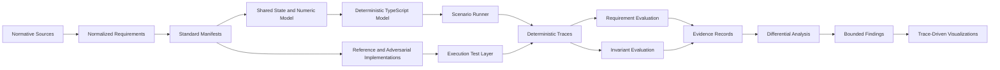

# SPECTRA

## Cross-Standard Asset Protocol Security Observatory

> **An executable, evidence-driven research laboratory for determining where apparently compatible asset systems cease to preserve the same execution, authorization, numeric, accounting, and settlement semantics.**

| Field                  | Current State                                                                  |
| ---------------------- | ------------------------------------------------------------------------------ |
| Repository             | `spectra-asset-protocol-lab`                                                   |
| Project type           | Independent protocol-security and financial-infrastructure research laboratory |
| Current phase          | Quantitative numeric semantics → executable `DecimalScale` design              |
| Runtime                | Node.js 24                                                                     |
| TypeScript             | 7.0.2, strict configuration                                                    |
| Executable scope       | Integer base-unit `Amount` primitive and arithmetic                            |
| Working specifications | State Model v0.1.1; Quantitative Numeric Semantics v0.1.0                      |
| Executable tests       | 8                                                                              |
| Status                 | Experimental and under active development                                      |
| Production readiness   | **Not claimed**                                                                |
| Formal verification    | **Not claimed**                                                                |

---

## 1. The Problem

Modern asset infrastructure routinely places heterogeneous blockchain assets behind common application-level abstractions.

Wallets, exchanges, custodians, bridges, payment systems, accounting engines, and protocol adapters may interact with assets through familiar operations such as:

```text
transfer
approve
transferFrom
balanceOf
totalSupply
```

A familiar interface establishes syntactic similarity.

It does **not** establish semantic equivalence.

Two systems that appear compatible at the interface boundary may differ materially in:

* execution and failure behavior;
* authorization semantics;
* realized debit and credit amounts;
* event/state relationships;
* numeric representation;
* decimal interpretation;
* supply controls;
* privileged operations;
* accounting treatment;
* settlement conditions;
* cross-domain state relationships.

SPECTRA investigates the consequences of treating those differences as if they did not exist.

The central systems problem is:

> **A higher-level integration may make an economic or security decision using evidence whose underlying meaning was not preserved across system boundaries.**

The project therefore treats compatibility as a hypothesis requiring evidence, not as a conclusion inherited from interface shape.

---


## 2. Research Thesis

SPECTRA begins from the following falsifiable thesis:

> **Interface-level compatibility is insufficient evidence of behavioral, accounting, or settlement equivalence when execution, failure, authorization, numeric, event, supply, and cross-domain semantics have not been evaluated independently.**

The thesis predicts that independently implemented systems exposing sufficiently similar interfaces may produce materially different results under the same explicit integration assumptions.

Evidence may strengthen the thesis when controlled experiments reproduce divergence in dimensions such as:

* state transitions;
* authorization outcomes;
* return or failure behavior;
* realized transfer amounts;
* event/state relationships;
* numeric interpretation;
* supply relationships;
* reconciliation;
* settlement state.

Evidence may weaken the thesis when independent implementations remain equivalent across the tested semantic dimensions under equivalent:

* initial states;
* ordered inputs;
* environmental assumptions;
* observation rules;
* comparison criteria.

Inconclusive experiments remain inconclusive.

They are not converted into favorable evidence.

---

## 3. Primary Research Question

> **Can heterogeneous fungible-asset behavior be represented by a shared executable semantic model strongly enough to identify where interface similarity fails to preserve behavioral, accounting, or settlement assumptions?**

This produces narrower research questions:

1. Which behaviors are normatively required by each reviewed standard?
2. Which behaviors are optional, permitted, implementation-defined, or unspecified?
3. Where does syntactic compatibility cease to imply behavioral compatibility?
4. Which behaviors can be represented as deterministic state transitions?
5. Which invariants remain meaningful across heterogeneous implementations?
6. When can requested transfer value differ from realized debit or credit?
7. When can observed events fail to establish realized state?
8. When can scale or unit interpretation change the represented economic quantity?
9. When can authorization assumptions diverge from actual execution semantics?
10. When can protocol state and external accounting state diverge?
11. Under which explicit conditions can canonical and remote supply relationships fail?
12. What evidence is sufficient for a bounded conformance statement?
13. What evidence is sufficient for a bounded security-relevant finding?
14. Can reference and adversarial implementations be evaluated under identical ordered inputs?
15. Can reconciliation and settlement divergence be reproduced deterministically?

---

## 4. Research Objectives

The initial research program has six objectives.

### 4.1 Normalize Semantics

Extract source-backed requirements from heterogeneous asset standards without assuming that similar interfaces imply equivalent behavior.

### 4.2 Build a Shared State Model

Represent security- and accounting-relevant asset behavior using explicit state, transitions, preconditions, postconditions, and frame conditions.

### 4.3 Make Numeric Meaning Explicit

Separate raw integer quantities from decimal scale, asset identity, scale source, and conversion policy so that economic interpretation is never inferred from an untyped number alone.

### 4.4 Reproduce Divergence

Construct controlled reference and adversarial scenarios capable of reproducing semantic differences under equivalent explicit inputs and assumptions.

### 4.5 Evaluate Invariants

Determine which supply, balance, authorization, event, replay, accounting, and settlement relationships can be expressed and tested as executable invariants.

### 4.6 Produce Bounded Evidence

Generate deterministic traces and evidence records that explain:

```text
where systems agree
where they diverge
why they diverge
which assumption failed
which requirement or invariant was affected
what evidence supports the conclusion
what remains unresolved
```

---

## 5. The Semantic Boundary Problem

SPECTRA models integration as a sequence of semantic boundaries:

```text
Specification
      ↓
Implementation
      ↓
Execution
      ↓
Observation
      ↓
Integration
      ↓
Accounting
      ↓
Settlement
```

For cross-domain systems:

```text
Canonical State
      ↓
Cross-Domain Mechanism
      ↓
Message / State Transition
      ↓
Remote State
```

An assumption introduced at one boundary may become an unverified premise at the next.

A representative failure chain is:

```text
Interface Similarity
        ↓
Integration Assumption
        ↓
Unverified Semantic Equivalence
        ↓
Incorrect Interpretation
        ↓
State / Authorization / Numeric Divergence
        ↓
Accounting or Reconciliation Error
        ↓
Potential Security or Financial Consequence
```

SPECTRA therefore seeks to identify the **earliest observable point at which semantic preservation fails**, rather than reporting only the final downstream discrepancy.

A reconciliation failure may originate in a scale error.

An accounting mismatch may originate in an assumption that requested amount equals realized amount.

A cross-domain supply discrepancy may originate in replay or message-processing semantics.

The visible failure and the originating semantic failure are not necessarily the same event.

---

## 6. Semantic Dimensions

SPECTRA separates asset behavior into explicit analytical dimensions.

### Execution

* success and failure behavior;
* return-value semantics;
* execution-status interpretation;
* resulting state transitions.

### Authorization

* caller requirements;
* ownership assumptions;
* allowance behavior;
* privileged operations;
* control boundaries.

### Transfer

* requested amount;
* debited amount;
* credited amount;
* realized transfer;
* conservation relationships.

### Observation

* event emission;
* event contents;
* event/state consistency;
* sufficiency of observed evidence.

### Numeric

* integer base units;
* decimal scale;
* exact representation;
* encoding and decoding;
* scale mismatch;
* conversion policy;
* residual and dust behavior.

### Supply

* minting and burning;
* total-supply transitions;
* canonical supply;
* remote supply;
* cross-domain conservation relationships.

### Accounting and Settlement

* protocol state;
* observed state;
* external accounting state;
* pending settlement;
* finalized settlement;
* reconciliation conditions.

A system may preserve one dimension while violating another.

SPECTRA does not collapse them into a single compatibility label.

---

## 7. A Representative Divergence

Consider an integration requesting:

```text
1,000,000 base units
```

and observing a transaction that completed successfully.

That observation alone does not establish that:

```text
recipient balance increased by exactly 1,000,000
sender balance decreased by exactly 1,000,000
requested amount equals realized amount
observed events describe the realized state transition
the correct decimal scale was applied
an external ledger recorded the correct economic quantity
the required settlement condition was reached
```

SPECTRA therefore distinguishes:

```text
requested behavior
executed behavior
observed behavior
realized state transition
recorded accounting effect
settled economic effect
```

Where equality is required, equality becomes an explicit property or invariant.

Where equality is not required, the relationship must be represented explicitly.

---

## 8. Research Method

SPECTRA converts protocol statements and observed behavior into progressively stronger research artifacts.

```text
Official / Normative Source
            ↓
Normalized Requirement
            ↓
Mathematical State Model
            ↓
Executable Domain Model
            ↓
Reference / Adversarial Implementation
            ↓
Deterministic Scenario
            ↓
Execution Trace
            ↓
Requirement / Invariant Evaluation
            ↓
Evidence Record
            ↓
Differential Analysis
            ↓
Bounded Assessment
            ↓
Trace-Driven Visualization
```

Each stage has a different evidentiary meaning.

Documentation is not executable evidence.

A model is not automatically a protocol implementation.

A passing test is not a security proof.

An implementation is not automatically representative of a production integration environment.

A visualization is not evidence merely because it is persuasive.

SPECTRA keeps these boundaries explicit.

---

## 9. Differential Research

Controlled comparison is preferred over anecdotal observation.

A comparative experiment should hold constant, where applicable:

```text
initial state
ordered inputs
asset identity
numeric interpretation
environmental assumptions
observation rules
comparison criteria
```

while varying the semantic implementation being examined.

Conceptually:

```text
                  Same Initial State
                         │
                  Same Ordered Inputs
                         │
            ┌────────────┴────────────┐
            ▼                         ▼
     Reference Model            Variant Model
            │                         │
            ▼                         ▼
        Trace A                   Trace B
            │                         │
            └────────────┬────────────┘
                         ▼
                Differential Analysis
                         ↓
             Requirement / Invariant
                    Evaluation
```

The desired research result is not simply:

> Implementation A behaved differently.

A stronger result is:

> **Under identical explicit assumptions and ordered inputs, implementation A and implementation B produced distinguishable traces. The first relevant divergence occurred at semantic dimension X, affected requirement or invariant Y, and was reproduced under environment Z.**

That is a reviewable research artifact.

---

## 10. Evidence Policy

Material claims are classified using the current project evidence taxonomy.

### `SPECIFIED`

A reviewed normative source explicitly requires, permits, recommends, or prohibits the behavior.

### `INFERRED`

A conclusion follows from reviewed primary evidence but is not expressed directly as a normative requirement.

### `UNSPECIFIED`

The reviewed source does not define the behavior precisely enough to support a conformance determination.

### `EXPERIMENTALLY_OBSERVED`

The behavior was reproduced under a documented implementation, environment, test, or scenario.

### `PROJECT_DEFINED`

The model, invariant, taxonomy, profile, or behavior is defined by SPECTRA itself.

A claim must not silently move from one evidence class to another.

Deterministic calculations or consequences may be recorded as derived analytical results, but `DERIVED` is not currently introduced as an additional canonical evidence class.

The distinction is deliberate.

```text
specification
    ≠
model
    ≠
implementation
    ≠
test
    ≠
observation
    ≠
finding
    ≠
security proof
```

---

## 11. Evidence Discipline

A material conclusion should answer:

1. **What was observed?**
2. **Under which explicit conditions?**
3. **What follows directly from the evidence?**
4. **What is the narrowest defensible interpretation?**
5. **What remains unresolved?**

The preferred analytical structure is:

```text
Given:
    initial state S
    ordered input I
    implementation or manifest M
    explicit assumptions A

Observed:
    trace T

Derived:
    transition S → S'

Evaluated:
    requirement R
    invariant V

Assessment:
    bounded conclusion C

Unresolved:
    evidence gaps G
```

The purpose is not to maximize the strength of a conclusion.

It is to keep the strength of the conclusion proportional to the evidence supporting it.

---

## 12. State and Numeric Foundations

SPECTRA represents modeled behavior as transitions over explicit state.

Conceptually:

```math
S_{t+1} = F(S_t, I_t, E_t)
```

where:

* (S_t) is current modeled state;
* (I_t) is an ordered input;
* (E_t) represents relevant execution or environmental conditions;
* (F) is the modeled transition function.

The current executable numeric foundation begins with `Amount`.

Its mathematical domain is:

```math
\mathbb{A}
=
\left\{
x \in \mathbb{Z}
\mid
x \geq 0
\right\}
```

`Amount` represents a non-negative integer quantity expressed in base units.

The implementation uses `bigint` so that core modeled asset quantities are not represented using binary floating-point approximation.

The current primitive supports:

```text
construction
runtime validation
canonical zero
exact integer addition
preconditioned subtraction
```

It does not yet implement:

```text
DecimalScale
decimal parsing
decimal formatting
asset identity
conversion policy
protocol-specific numeric limits
```

### Decimal Scale

The shared mathematical decimal-scale domain is:

```math
\mathbb{D}
=
\left\{
d \in \mathbb{Z}
\mid
d \geq 0
\right\}
```

with scale factor:

```math
P(d) = 10^d
```

For base-unit amount (b):

```math
decode_d(b)
=
\frac{b}{10^d}
```

Exact encoding of a human-readable value (h) requires:

```math
h \times 10^d \in \mathbb{Z}
```

and:

```math
h \times 10^d \geq 0
```

These relationships are specified.

They are not yet complete executable conversion APIs.

---

## 13. Current Evidence Boundary

The repository currently contains three maturity layers.

### Layer I — Implemented and Executable

```text
strict TypeScript runtime
integer base-unit Amount primitive
runtime Amount validation
canonical zero representation
exact integer addition
preconditioned subtraction
eight executable Amount tests
GitHub Actions validation
```

These claims apply only within the current implementation and test boundary.

### Layer II — Specified and Reviewable

```text
Amount and DecimalScale mathematical domains
scale-factor relationship
exact encoding and decoding relationships
exact-representability preconditions
round-trip properties
known-versus-unknown scale distinction
scale-source classification
scale-mismatch analysis
conversion-policy taxonomy
numeric failure modes
implementation requirements
test obligations
evidence boundaries
```

These are specification-level artifacts.

They are not described as executable until corresponding implementation and test evidence exist.

### Layer III — Planned or Design-Unresolved

```text
DecimalScale runtime representation
implementation-level maximum scale
known-versus-unknown scale runtime model
canonical exact-decimal grammar
decimal parser and formatter
asset identity
scale-source runtime representation
conversion error model
residual and dust representation
cross-scale reconciliation
protocol adapters
```

An unresolved design question remains unresolved.

A roadmap entry is not evidence of implementation.

---

## 14. Comparative Research Scope

The initial comparative program targets:

```text
ERC-20
TRC-20
BEP-20
ARC-200
```

The purpose is not to declare these standards equivalent or incompatible in advance.

The program seeks to determine:

```text
where semantics coincide
where semantics diverge
where behavior is underspecified
where implementations diverge from integration assumptions
which differences become security or accounting relevant
```

Machine-readable standard manifests are planned research infrastructure and are not yet represented as completed artifacts.

### SASP-1

SASP-1 — Secure Asset Semantics Profile — is a project-defined experimental research construct intended to represent security-relevant asset semantics in deterministic, machine-readable form.

It is not:

* an official blockchain standard;
* an accepted industry specification;
* a production asset standard;
* a replacement for existing standards;
* evidence that an implementation is secure.

Its purpose is controlled semantic comparison.

---

## 15. Invariant Program

The initial research program identifies the following invariant families:

1. supply conservation;
2. balance conservation under explicitly defined transfer semantics;
3. authorization integrity;
4. allowance safety;
5. event/state consistency;
6. replay uniqueness;
7. settlement consistency;
8. deterministic replay.

These are research targets.

An invariant becomes executable evidence only when its:

```text
explicit definition
        +
model boundary
        +
executable implementation
        +
valid input domain
        +
test or scenario coverage
        +
reproducible result
```

are present.

---

## 16. System Architecture


```mermaid
flowchart LR
    A[Normative Sources] --> B[Normalized Requirements]
    B --> C[Standard Manifests]

    C --> D[Shared State and Numeric Model]
    D --> E[Deterministic TypeScript Model]

    C --> F[Reference and Adversarial Implementations]

    E --> G[Scenario Runner]
    F --> H[Execution Test Layer]

    G --> I[Deterministic Traces]
    H --> I

    I --> J[Requirement Evaluation]
    I --> K[Invariant Evaluation]

    J --> L[Evidence Records]
    K --> L

    L --> M[Differential Analysis]
    M --> N[Bounded Findings]
    N --> O[Trace-Driven Visualizations]
```

### Architecture Principle

No visualization, compatibility statement, finding, or security claim should exist independently from the evidence supporting it.

---

## 17. Repository Structure

Current tracked structure:

```text
spectra-asset-protocol-lab/
├── docs/
│   ├── README.md
│   ├── numeric-semantics.md
│   └── state-model.md
├── model/
│   └── amount.ts
├── standards/
│   └── README.md
├── test/
│   └── amount.test.ts
├── .editorconfig
├── .gitignore
├── .npmrc
├── .nvmrc
├── package-lock.json
├── package.json
├── tsconfig.json
└── README.md
```

Planned research surfaces include:

```text
contracts/
traces/
scripts/
frontend/
```

Directories are introduced only when they contain substantive and reviewable artifacts.

Structure is not treated as evidence of capability.

---

## 18. Validation

Select the repository runtime:

```bash
nvm use
```

Install the committed dependency graph:

```bash
npm ci
```

Run the complete current validation boundary:

```bash
npm run check
```

The validation pipeline currently covers:

```text
TypeScript type checking
        ↓
clean build
        ↓
JavaScript emission
        ↓
Node.js test execution
```

A successful validation run establishes only that the current implementation passes the current validation boundary.

It does not establish:

```text
complete correctness
complete protocol conformance
security
economic safety
production readiness
formal verification
```

---

## 19. Near-Term Research and Engineering Roadmap

### Phase I — Executable State Core

Completed:

* [x] Node.js and TypeScript project baseline
* [x] strict compiler configuration
* [x] non-negative integer `Amount` primitive
* [x] initial `Amount` unit and boundary tests
* [x] state-transition working specification
* [x] quantitative numeric-semantics working specification

Next:

* [ ] freeze executable `DecimalScale` representation
* [ ] define implementation-level scale bounds
* [ ] implement `DecimalScale`
* [ ] model known-versus-unknown scale
* [ ] define canonical exact-decimal grammar
* [ ] implement exact decimal parsing
* [ ] implement exact encode/decode operations
* [ ] define deterministic `Amount` serialization
* [ ] implement asset identity
* [ ] implement scale-source representation
* [ ] define explicit conversion errors
* [ ] implement immutable token state
* [ ] define operation and result unions
* [ ] implement pure state transitions
* [ ] implement foundational invariants
* [ ] define deterministic trace schema

### Phase II — Standard Manifests

* [ ] ERC-20
* [ ] TRC-20
* [ ] BEP-20
* [ ] ARC-200
* [ ] SASP-1
* [ ] manifest validation

### Phase III — Adversarial Semantics

* [ ] return and failure divergence
* [ ] fee-on-transfer behavior
* [ ] event/state inconsistencies
* [ ] allowance edge cases
* [ ] precision normalization
* [ ] scale mismatch
* [ ] authorization divergence

### Phase IV — Contract Evidence Layer

* [ ] minimal reference implementations
* [ ] deliberately non-conforming variants
* [ ] secured variants
* [ ] unit tests
* [ ] fuzz tests
* [ ] invariant tests
* [ ] execution-trace export
* [ ] differential comparison

### Phase V — Accounting and Settlement

* [ ] custody-ledger reconciliation
* [ ] pending and finalized settlement states
* [ ] replay protection
* [ ] lock/mint/burn/release accounting
* [ ] canonical-versus-remote supply relationships
* [ ] settlement-divergence measurement

### Phase VI — Visual Observatory

* [ ] standard comparison views
* [ ] state-transition explorer
* [ ] invariant-status views
* [ ] adversarial comparison views
* [ ] reconciliation visualizations
* [ ] deterministic trace inspection
* [ ] evidence provenance

Visualization remains downstream of the evidence model.

---

## 20. Research and Engineering Principles

1. **Evidence before narrative.** Claims begin with observable or explicitly sourced evidence.
2. **Semantics before interfaces.** Interface similarity is an analytical starting point, not proof of equivalence.
3. **Financial domains remain explicit.** Quantity, scale, identity, and interpretation are separate concerns.
4. **Exact arithmetic at the core.** Binary floating point is not authoritative for core modeled asset quantities.
5. **Preconditions are part of behavior.**
6. **Postconditions must be observable.**
7. **Frame conditions define what must remain unchanged.**
8. **Failure behavior is protocol data.**
9. **Events are evidence, not independent proof of state.**
10. **Execution is not settlement.**
11. **Protocol state and external accounting state require explicit reconciliation.**
12. **Comparative experiments control assumptions wherever possible.**
13. **Determinism is a research property.**
14. **Claims remain bounded by their evidence.**
15. **Unknown behavior remains unknown until evidence resolves it.**
16. **Negative results are valid research results.**
17. **Material research artifacts remain independently reviewable.**

---

## 21. Explicit Non-Goals

SPECTRA does not currently claim to:

* provide a production-ready asset standard;
* provide a complete audit of any asset ecosystem;
* prove vulnerability absence;
* formally verify the complete system;
* implement production custody infrastructure;
* implement a production bridge;
* reproduce complete consensus behavior;
* establish production risk directly from simplified model behavior;
* provide trading or investment functionality.

These boundaries are part of the research design.

---

## 22. What Constitutes a Strong Result?

A strong SPECTRA result should resemble:

> Under initial state **S**, ordered input sequence **I**, implementation or manifest **M**, and explicitly declared assumptions **A**, the system produced trace **T**. The resulting transition **S → S'** satisfied or violated requirement **R** and invariant **V**. The relevant divergence was localized to semantic dimension **X** and reproduced under the documented environment. The evidence therefore supports bounded conclusion **C**. Generalization beyond the tested implementation and assumptions remains unsupported.

This is intentionally narrower than:

> Standard X is insecure.

or:

> Protocol Y is incompatible.

The narrower statement is more useful because it is:

* reproducible;
* reviewable;
* falsifiable;
* attributable;
* bounded;
* extensible.

---

## 23. Research Direction

SPECTRA ultimately investigates one recurring systems question:

> **When does an abstraction stop preserving the economic and security meaning of the system beneath it?**

The project approaches that question incrementally:

```text
Amount
  ↓
DecimalScale
  ↓
State Transition
  ↓
Asset Semantics
  ↓
Standard Manifest
  ↓
Adversarial Variant
  ↓
Deterministic Trace
  ↓
Invariant Evaluation
  ↓
Accounting
  ↓
Settlement
  ↓
Cross-Domain Reconciliation
```

SPECTRA does not attempt to make heterogeneous asset systems appear uniform.

It attempts to make their differences **observable, reproducible, and semantically attributable**.

The governing discipline is:

> **Do not infer equivalence from interface shape.**
> **Do not infer correctness from execution success.**
> **Do not infer settlement from observation.**
> **Do not infer security from a passing test.**
> **Preserve the evidence chain from specification to state transition to economic consequence.**

The ultimate objective is not another compatibility matrix.

It is a reproducible method for answering:

```text
What was specified?
        ↓
What was implemented?
        ↓
What actually executed?
        ↓
What was observed?
        ↓
What state was realized?
        ↓
What quantity was accounted?
        ↓
What condition was settled?
        ↓
Where, if anywhere, did semantic preservation fail?
```

**SPECTRA is an attempt to turn that chain into an executable research instrument.**

