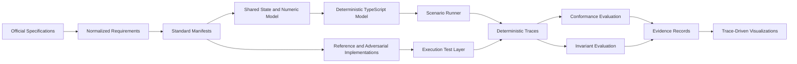

# SPECTRA

## Cross-Standard Asset Protocol Security Observatory

> An executable, evidence-driven research laboratory for studying where
> apparently compatible asset systems diverge in execution, authorization,
> numeric interpretation, accounting, and settlement semantics.

| Field                  | Current State                                                                  |
| ---------------------- | ------------------------------------------------------------------------------ |
| Repository             | `spectra-asset-protocol-lab`                                                   |
| Project type           | Independent protocol-security and financial-infrastructure research laboratory |
| Current phase          | Quantitative numeric semantics → executable `DecimalScale` design              |
| Runtime                | Node.js 24                                                                     |
| TypeScript             | 7.0.2, strict configuration                                                    |
| Executable scope       | Integer base-unit `Amount` primitive and arithmetic                            |
| Working specifications | State Model v0.1.1; Quantitative Numeric Semantics v0.1.0                      |
| Executable tests       | 8                                                                              |
| Status                 | Experimental and under active development                                      |
| Production readiness   | Not claimed                                                                    |
| Formal verification    | Not claimed                                                                    |

---

## 1. The Problem

Modern asset infrastructure frequently places heterogeneous blockchain assets
behind common application-level abstractions.

A wallet, exchange, custodian, bridge, payment system, accounting engine, or
protocol adapter may encounter assets exposing familiar operations such as:

```text
transfer
approve
transferFrom
balanceOf
totalSupply
```

Interface similarity, however, does not establish behavioral equivalence.

Two implementations that appear compatible at the interface boundary may differ
in:

* return-value behavior;
* failure signaling;
* authorization semantics;
* realized transfer amounts;
* event-state consistency;
* decimal and precision interpretation;
* supply controls;
* privileged operations;
* execution-environment assumptions;
* bridge accounting;
* custody-ledger treatment;
* settlement assumptions.

SPECTRA studies the consequences of treating those differences as if they did
not exist.

The central systems problem is:

> **A higher-level integration may make an economic or security decision using
> evidence whose underlying semantics were not preserved across system
> boundaries.**

The research surface therefore extends across:

```text
specification
    ↓
implementation
    ↓
execution
    ↓
observation
    ↓
integration
    ↓
accounting
    ↓
settlement
```

and, where relevant:

```text
canonical state
    ↓
cross-domain mechanism
    ↓
remote state
```

A mismatch introduced at one boundary may invalidate assumptions made at a
later boundary.

---

## 2. Research Thesis

SPECTRA begins with a falsifiable thesis:

> Interface-level compatibility is insufficient evidence of behavioral,
> accounting, or settlement equivalence when execution, failure,
> authorization, numeric, event, supply, and cross-domain semantics have not
> been evaluated independently.

The thesis predicts that systems exposing sufficiently similar interfaces can
still produce materially different outcomes under the same explicit integration
assumptions.

This is not treated as a predetermined conclusion.

Evidence may strengthen the thesis when apparently compatible systems produce
different:

* state transitions;
* authorization outcomes;
* return or failure behavior;
* realized transfer amounts;
* event-state relationships;
* numeric interpretations;
* supply relationships;
* reconciliation results.

Evidence may weaken the thesis when independently implemented systems remain
equivalent across the tested semantic dimensions under the same explicit
assumptions.

Inconclusive experiments remain inconclusive.

They are not converted into supporting evidence.

---

## 3. Primary Research Question

> Can heterogeneous fungible-asset behavior be represented under a shared,
> executable analytical model strongly enough to identify where interface
> similarity fails to preserve behavioral, accounting, or settlement
> assumptions?

This question produces a set of narrower research problems:

1. Which behaviors are explicitly required by each reviewed standard?
2. Which behaviors are optional, implementation-defined, or unspecified?
3. Can interface compatibility be separated from behavioral compatibility?
4. Can relevant asset behavior be modeled as deterministic state transitions?
5. Which invariants remain meaningful across multiple implementations?
6. When can requested transfer value differ from realized transfer value?
7. When can event observations disagree with realized state?
8. When can decimal or unit interpretation change the represented economic quantity?
9. When can protocol state and external accounting state diverge?
10. Under which modeled conditions can canonical and remote supply relationships fail?
11. What evidence is sufficient to support a bounded conformance statement?
12. What evidence is sufficient to support a bounded security finding?
13. Can reference and adversarial implementations be compared under identical ordered inputs?
14. Can modeled reconciliation and settlement divergence be reproduced deterministically?

---

## 4. Failure Model

A representative failure chain is:

```text
Interface Similarity
        ↓
Integration Assumption
        ↓
Hidden Semantic Difference
        ↓
Incorrect State Interpretation
        ↓
Accounting or Authorization Divergence
        ↓
Reconciliation Failure
        ↓
Security or Financial Loss Condition
```

Consider an integration requesting:

```text
1,000,000 base units
```

and observing a transaction that completed without reverting.

That observation alone does not establish that:

```text
recipient balance increased by exactly 1,000,000
sender balance decreased by exactly 1,000,000
observed events describe the realized state transition
the correct decimal scale was applied
an external ledger recorded the correct economic quantity
the assumed settlement condition was reached
```

SPECTRA therefore separates:

```text
requested behavior
observed behavior
realized state transition
recorded accounting effect
settled economic effect
```

These observations and effects may align.

Their equivalence must be established rather than assumed.

---

## 5. Representative Divergence Classes

### Return and Failure Semantics

An integration may interpret successful transaction execution as successful
asset transfer even when the asset-level result expresses different semantics.

SPECTRA treats transaction execution status and modeled economic success as
separate observations.

### Realized Transfer Amount

A requested amount and a realized balance change need not be assumed equal.

Transfer mechanics may require the integration to distinguish:

```text
requested amount
debited amount
credited amount
```

rather than collapsing them into one value.

### Event–State Consistency

Events can serve as integration evidence, but event interpretation must remain
consistent with the modeled resulting state.

SPECTRA does not treat event observation as independent proof of state.

### Numeric and Scale Interpretation

The same raw integer can represent different human-readable quantities under
different decimal scales.

For example:

```text
raw amount = 1,000,000
scale      = 6
```

represents:

```text
1
```

The interpretation of scale is therefore part of the accounting model.

### Authorization Semantics

Similar transfer and approval interfaces do not establish identical
authorization behavior.

Authorization requirements must be modeled explicitly rather than inferred from
interface shape.

### Accounting and Settlement

An external ledger may record value before the underlying system reaches the
settlement condition assumed by the integration.

Protocol state, observed state, accounting state, and settlement state are
therefore modeled as distinct analytical layers.

### Cross-Domain Supply Relationships

Cross-domain mechanisms may create relationships among values such as:

```text
canonical locked supply
burned supply
remote minted supply
released supply
processed messages
```

SPECTRA will test explicitly defined relationships among these values rather
than assuming conservation from interface behavior alone.

---

## 6. Research Method

SPECTRA converts protocol statements and observed behavior into increasingly
strong evidence artifacts.

```text
Official Requirement
        ↓
Normalized Requirement
        ↓
Mathematical State Model
        ↓
Executable Domain Model
        ↓
Reference or Adversarial Implementation
        ↓
Executable Test or Scenario
        ↓
Deterministic Trace
        ↓
Invariant or Conformance Evaluation
        ↓
Evidence Record
        ↓
Trace-Driven Visualization
```

Each stage has a different evidentiary meaning.

Documentation is not executable evidence.

A passing test is not a security proof.

A model is not automatically a protocol implementation.

A protocol implementation is not automatically a representation of a
production integration environment.

SPECTRA keeps these boundaries explicit.

---

## 7. Evidence Policy

Material claims are classified using the following evidence categories.

### `SPECIFIED`

A reviewed normative source explicitly requires, recommends, permits, or
prohibits the behavior.

### `INFERRED`

The conclusion is derived from reviewed primary sources but is not expressed as
a direct normative requirement.

### `UNSPECIFIED`

The reviewed source does not define the behavior precisely enough to support a
conformance decision.

### `EXPERIMENTALLY_OBSERVED`

The behavior was reproduced by a documented implementation, test, or scenario
under a defined environment.

### `PROJECT_DEFINED`

The behavior, invariant, model, or profile belongs to SPECTRA rather than an
external standard.

A claim must not silently move from one evidence class to another.

---

## 8. Research Success Criterion

SPECTRA is not designed to produce statements such as:

```text
Standard A and Standard B are compatible.
```

The intended output is more constrained.

A useful result has the form:

```text
Given:

initial state S,
ordered input I,
implementation or manifest M,
explicit assumptions A,

the system produced:

transition S → S'

which satisfied or violated:

requirement R
invariant V

with evidence E.
```

The strongest intended result is therefore a reproducible explanation of:

```text
where systems agree
where they diverge
why they diverge
which assumptions are required
which invariant or requirement is affected
what evidence supports the conclusion
what remains unresolved
```

---

## 9. Current Evidence Boundary

The repository currently contains three maturity layers.

### Implemented and Executable

```text
strict TypeScript runtime
integer base-unit Amount primitive
runtime Amount validation
canonical zero representation
exact integer addition
preconditioned subtraction
eight executable Amount tests
GitHub Actions validation workflow
```

These claims apply only within the current implementation, runtime, repository,
and test boundaries.

### Specified and Reviewable, but Not Executable

```text
Amount and DecimalScale mathematical domains
decimal scale-factor relationship
exact encoding and decoding relationships
exact-representability preconditions
round-trip properties
known-versus-unknown scale distinction
scale-source classification
scale-mismatch analysis
conversion-policy taxonomy
numeric failure modes
future implementation requirements
test obligations
evidence boundaries
```

These behaviors are described in the quantitative numeric working
specification.

They do not establish corresponding executable implementations.

### Planned or Design-Unresolved

```text
DecimalScale runtime representation
implementation-level maximum scale
known-versus-unknown scale runtime type
canonical exact-decimal grammar
decimal parser and formatter
asset identity
scale-source runtime representation
conversion error model
residual and dust representation
cross-scale reconciliation
protocol adapters
```

A documented behavior is not described as executable until implementation and
test evidence exist.

An unresolved design question is not described as a completed specification.

An implemented behavior is not generalized beyond its explicit evidence
boundary.

---

## 10. Current Executable Foundation

### Runtime

```text
Node.js:       >=24 <25
TypeScript:    7.0.2
Modules:       ECMAScript Modules
Resolution:    NodeNext
Test runner:   node:test
Package:       npm
```

The compiler baseline includes strict TypeScript checks.

Those checks improve model discipline but do not replace runtime validation,
testing, threat modeling, or formal reasoning.

### `Amount`

The first executable financial-domain primitive is:

```text
model/amount.ts
```

It models a non-negative integer base-unit quantity.

```math
\mathbb{A}
=
\left\{
x \in \mathbb{Z}
\mid
x \geq 0
\right\}
```

The implementation uses `bigint` so that core modeled asset quantities are not
stored using binary floating-point approximation.

The current primitive supports:

```text
construction
runtime validation
canonical zero
exact addition
preconditioned subtraction
```

It does not yet provide:

```text
decimal parsing
decimal formatting
DecimalScale
asset identity
rounding policy
protocol-specific numeric limits
```

---

## 11. Quantitative Numeric Semantics

The numeric working specification separates:

```text
integer base-unit Amount
DecimalScale
human-readable interpretation
asset identity
scale source
exact conversion
conversion policy
protocol-specific representation
```

For decimal scale:

```math
d \in \mathbb{D}
```

where:

```math
\mathbb{D}
=
\left\{
d \in \mathbb{Z}
\mid
d \geq 0
\right\}
```

The scale factor is:

```math
P(d) = 10^d
```

For base-unit amount (b):

```math
decode_d(b)
=
\frac{b}{10^d}
```

Exact encoding of a human-readable value (h) requires:

```math
h \times 10^d \in \mathbb{Z}
```

and:

```math
h \times 10^d \geq 0
```

These relationships are specified.

`DecimalScale`, parsing, formatting, and encode/decode APIs are not yet
implemented.

See:

* [Quantitative Numeric Semantics](docs/numeric-semantics.md)

---

## 12. Working Specifications

### State Model

[State Model](docs/state-model.md)

Current classification:

```text
Working Specification v0.1.1
```

It defines the current mathematical and transition-model foundation.

### Quantitative Numeric Semantics

[Quantitative Numeric Semantics](docs/numeric-semantics.md)

Current classification:

```text
Working Specification v0.1.0
```

It defines the current Amount, scale, exactness, conversion-policy, and numeric
evidence boundaries.

### Documentation Index

[Documentation Index](docs/README.md)

---

## 13. Comparative Research Scope

The planned comparative program begins with four asset-standard families:

```text
ERC-20
TRC-20
BEP-20
ARC-200
```

The purpose is not to assume that these systems are equivalent.

The purpose is to extract source-backed requirements and identify where
apparently similar abstractions preserve or fail to preserve modeled semantics.

Machine-readable standard manifests are planned work and are not yet
implemented.

---

## 14. SASP-1

### Secure Asset Semantics Profile — Experimental Research Construct

SASP-1 is a project-defined experimental profile intended to express
security-relevant asset behavior in a deterministic and machine-readable form.

Planned categories include:

* interface requirements;
* return and failure semantics;
* authorization rules;
* event requirements;
* balance transitions;
* allowance transitions;
* supply controls;
* privilege extensions;
* decimal behavior;
* integration assumptions;
* tested invariants;
* known limitations.

SASP-1 is not:

* an official blockchain standard;
* an accepted industry proposal;
* a production-ready token specification;
* a replacement for existing standards;
* evidence that an implementation is secure.

The SASP-1 manifest remains planned work.

---

## 15. System Architecture


```mermaid
flowchart LR
    A[Official Specifications] --> B[Normalized Requirements]
    B --> C[Standard Manifests]

    C --> D[Shared State and Numeric Model]

    D --> E[Deterministic TypeScript Model]
    C --> F[Reference and Adversarial Implementations]

    E --> G[Scenario Runner]
    F --> H[Execution Test Layer]

    G --> I[Deterministic Traces]
    H --> I

    I --> J[Conformance Evaluation]
    I --> K[Invariant Evaluation]

    J --> L[Evidence Records]
    K --> L

    L --> M[Trace-Driven Visualizations]
```

### Architecture Principle

No visualization, compatibility statement, finding, or security claim should
exist independently from the evidence supporting it.

---

## 16. Planned Invariant Program

The initial research program currently identifies the following invariant
families:

1. supply conservation;
2. balance conservation under explicitly defined transfer semantics;
3. authorization integrity;
4. allowance safety;
5. event–state consistency;
6. replay uniqueness;
7. settlement consistency;
8. deterministic replay.

These are research targets.

They must not be described as executable invariants until corresponding model,
implementation, and test evidence exist.

---

## 17. Repository Structure

Current tracked structure:

```text
spectra-asset-protocol-lab/
├── docs/
│   ├── README.md
│   ├── numeric-semantics.md
│   └── state-model.md
├── model/
│   └── amount.ts
├── standards/
│   └── README.md
├── test/
│   └── amount.test.ts
├── .editorconfig
├── .gitignore
├── .npmrc
├── .nvmrc
├── package-lock.json
├── package.json
├── tsconfig.json
└── README.md
```

Directories are added only when they contain substantive and reviewable
artifacts.

Planned areas include:

```text
contracts/
traces/
scripts/
frontend/
```

---

## 18. Validation

Install the repository runtime:

```bash
nvm use
```

Install the exact dependency graph:

```bash
npm ci
```

Run the complete current validation boundary:

```bash
npm run check
```

The command currently covers:

```text
TypeScript type checking
        ↓
clean build
        ↓
JavaScript emission
        ↓
Node.js test execution
```

A successful validation run supports only the behavior directly covered by the
current implementation and tests.

It does not establish complete correctness or system security.

---

## 19. Near-Term Engineering Roadmap

### Phase 1 — Executable State Core

Completed:

* [x] Node.js and TypeScript project baseline
* [x] strict compiler configuration
* [x] non-negative integer `Amount` primitive
* [x] initial `Amount` unit and boundary tests
* [x] state-transition working specification
* [x] quantitative numeric-semantics working specification

Next:

* [ ] freeze executable `DecimalScale` representation
* [ ] define implementation-level scale bounds
* [ ] implement `DecimalScale`
* [ ] model known-versus-unknown scale
* [ ] define canonical exact-decimal grammar
* [ ] implement exact decimal-string parsing
* [ ] implement exact encode/decode operations
* [ ] define deterministic `Amount` serialization
* [ ] implement asset identity
* [ ] implement scale-source representation
* [ ] define explicit conversion errors
* [ ] implement immutable token state
* [ ] define operation and result unions
* [ ] implement pure state transitions
* [ ] implement foundational invariants
* [ ] define deterministic trace schema

### Phase 2 — Standard Manifests

* [ ] ERC-20
* [ ] TRC-20
* [ ] BEP-20
* [ ] ARC-200
* [ ] SASP-1
* [ ] manifest validation

### Phase 3 — Adversarial Semantics

* [ ] return and failure variants
* [ ] fee-on-transfer behavior
* [ ] event-state inconsistencies
* [ ] allowance scenarios
* [ ] precision-normalization failures

### Phase 4 — Contract Evidence Layer

* [ ] minimal reference implementation
* [ ] deliberately non-compliant variants
* [ ] secured variants
* [ ] unit tests
* [ ] fuzz tests
* [ ] invariant tests
* [ ] execution-trace export

### Phase 5 — Settlement and Cross-Domain Model

* [ ] custody-ledger reconciliation
* [ ] pending and finalized settlement states
* [ ] replay protection
* [ ] lock/mint/burn/release accounting
* [ ] canonical-versus-remote supply comparison
* [ ] settlement-divergence measurement

### Phase 6 — Visual Observatory

* [ ] comparison views
* [ ] state-transition explorer
* [ ] invariant-status views
* [ ] adversarial comparison views
* [ ] reconciliation visualizations
* [ ] deterministic trace inspection

---

## 20. Research and Engineering Principles

1. Primary and normative sources take precedence over secondary summaries.
2. Interface similarity is not treated as behavioral equivalence.
3. Financial quantities carry explicit domain meaning.
4. Core modeled asset accounting uses integer base units.
5. Core accounting does not use binary floating point as the authoritative representation.
6. Preconditions and postconditions are explicit.
7. Frame conditions identify what may and may not change.
8. Failure semantics are modeled explicitly.
9. Events are evidence, not independent proof of state.
10. Transaction execution and economic success are separate concepts.
11. Protocol state and external ledger state are reconciled separately.
12. Comparative experiments use equivalent explicit inputs and assumptions.
13. Deterministic replay is versioned and reproducible.
14. Unsupported claims and limitations remain visible.
15. A test result is never generalized beyond its test boundary.
16. Every material change is independently reviewable.
17. Research conclusions remain proportional to available evidence.

---

## 21. Explicit Non-Goals

SPECTRA does not currently claim to:

* provide a production-ready asset standard;
* provide a complete audit of any asset ecosystem;
* prove vulnerability absence;
* formally verify the complete system;
* implement production custody infrastructure;
* implement a production bridge;
* reproduce complete consensus behavior;
* provide investment or trading functionality.

---

## 22. Research Direction

SPECTRA is ultimately investigating a single recurring question:

> **When does an abstraction stop preserving the economic and security meaning
> of the system beneath it?**

The repository answers that question incrementally.

Not through interface similarity.

Not through unsupported compatibility labels.

Through explicit assumptions, mathematical models, executable behavior,
deterministic experiments, invariants, reconciliation, and bounded evidence.
