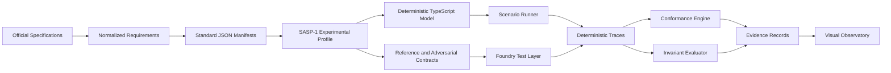

# SPECTRA

## Cross-Standard Asset Protocol Security Observatory

> An executable and evidence-driven research laboratory for analyzing
> asset-standard semantics, protocol invariants, interoperability failures,
> and financial-settlement risks across blockchain ecosystems.

| Field                  | Current value                                                                  |
| ---------------------- | ------------------------------------------------------------------------------ |
| Repository             | `spectra-asset-protocol-lab`                                                   |
| Current phase          | Quantitative numeric-semantics specification                                   |
| Project type           | Independent protocol-security and financial-infrastructure research laboratory |
| Primary language       | English                                                                        |
| Runtime family         | Node.js 24 LTS                                                                 |
| TypeScript             | 7.0.2                                                                          |
| Executable scope       | Strict TypeScript runtime and integer base-unit `Amount` primitive             |
| Working specifications | State Model v0.1.1 and Quantitative Numeric Semantics v0.1.0                   |
| Status                 | Experimental and under active development                                      |
| Production readiness   | Not claimed                                                                    |
| Formal verification    | Not claimed                                                                    |

---

## 1. Executive Summary

SPECTRA is an independent research and engineering project for studying how
fungible-asset standards behave across different blockchain ecosystems.

The project investigates a central problem:

> Similar interfaces do not necessarily imply equivalent execution,
> authorization, accounting, failure, event, precision, or settlement
> behavior.

An integration may expose familiar functions such as:

```text
transfer
approve
transferFrom
balanceOf
totalSupply
```

while still differing materially in:

* return-value behavior;
* failure signaling;
* authorization rules;
* event semantics;
* fee and transfer realization;
* decimal representation;
* supply controls;
* privileged operations;
* execution-environment assumptions;
* bridge and custody accounting;
* settlement finality.

SPECTRA converts these differences into explicit, testable, and reviewable
technical artifacts.

The intended evidence path is:

```text
Official Requirement
        ↓
Normalized Requirement
        ↓
Mathematical State Model
        ↓
Executable TypeScript Model
        ↓
Reference or Adversarial Implementation
        ↓
Executable Test or Scenario
        ↓
Deterministic Trace
        ↓
Invariant or Conformance Result
        ↓
Evidence Record
        ↓
Human-Readable Visualization
```

### Current Evidence Boundary

The repository currently contains three distinct maturity layers.

#### Implemented and Executable

```text
strict TypeScript runtime
integer base-unit Amount primitive
runtime Amount validation
canonical zero representation
exact integer addition
preconditioned subtraction
eight executable Amount tests
GitHub Actions validation workflow
```

These capabilities are supported only within their current implementation,
runtime, test, and repository boundaries.

#### Specified and Reviewable, but Not Executable

```text
Amount and DecimalScale mathematical domains
decimal scale-factor relationship
exact encoding and decoding relationships
exact-representability preconditions
exact round-trip properties
known-versus-unknown scale distinction
scale-source classification
scale-mismatch error derivation
conversion-policy taxonomy
numeric security and financial failure modes
future implementation and test obligations
numeric evidence and claim boundaries
```

These behaviors and constraints are documented in the quantitative numeric
working specification.

They guide implementation but do not establish that corresponding executable
types, parsers, conversion functions, adapters, or reconciliation mechanisms
already exist.

#### Planned or Design-Unresolved

```text
DecimalScale runtime representation
implementation-level maximum scale
known-versus-unknown scale runtime type
canonical exact-decimal input grammar
decimal parser and formatter APIs
asset-identity representation
conversion result and error unions
residual and dust representation
cross-scale reconciliation records
protocol-adapter implementations
```

These subjects have been identified as required design work, but their complete
executable contracts have not yet been frozen.

A documented behavior must not be described as executable until an
implementation and corresponding test evidence exist.

An unresolved design question must not be described as a completed
specification.

An implemented behavior must not be generalized beyond its explicit runtime,
model, test, protocol, and evidence boundaries.

---

## 2. Primary Research Question

Can the transfer, approval, authorization, supply, event, precision, and
cross-chain behaviors of different blockchain asset standards be represented
under a shared executable model so that semantic inconsistencies, security
failures, and financial-settlement divergences can be detected before
integration?

This question is decomposed into the following research problems:

1. Which behaviors are explicitly required by each official standard?
2. Which behaviors are optional, implementation-specific, or unspecified?
3. Can interface compatibility be separated from behavioral compatibility?
4. Can protocol behavior be expressed as deterministic state transitions?
5. Which invariants remain meaningful across different asset implementations?
6. When can on-chain state and off-chain accounting diverge?
7. Which evidence is sufficient to support a conformance claim?
8. Which evidence is sufficient to support a security finding?
9. Can vulnerable and secured implementations be compared under identical
   ordered inputs?
10. Can settlement divergence be reproduced and measured deterministically?

---

## 3. Research Thesis

SPECTRA begins with the following falsifiable thesis:

> Interface-level compatibility is insufficient to establish protocol or
> settlement equivalence unless return handling, failure signaling,
> authorization, event-state consistency, realized transfer amounts,
> precision rules, execution-environment assumptions, and cross-chain
> accounting are evaluated independently.

This thesis is not treated as a predetermined conclusion.

The project must identify:

* evidence supporting the thesis;
* evidence weakening the thesis;
* conditions under which the thesis may be false;
* behaviors that remain unresolved;
* limitations of every experiment;
* assumptions required for every conclusion.

---

## 4. Why This Problem Matters

Asset integrations often operate across several independently implemented
layers:

```text
Smart Contract
        ↓
Blockchain Execution Environment
        ↓
RPC or Indexing Layer
        ↓
Wallet, Exchange, or Custodian Adapter
        ↓
Internal Ledger
        ↓
Reconciliation and Settlement Process
```

A successful transaction at one layer does not automatically prove economic
success at every other layer.

Examples include:

* a token function returns `false` without reverting;
* a token returns no value despite an expected Boolean interface;
* an event reports an amount that differs from the realized balance change;
* a fee-on-transfer token credits less than the requested amount;
* an integration assumes the wrong decimal scale;
* a bridge message is processed more than once;
* a custody ledger credits value before final settlement;
* remote minted supply exceeds the amount locked on the canonical chain.

SPECTRA models these failures as state, transition, evidence, and
reconciliation problems rather than treating them as isolated API issues.

---

## 5. Initial Standard Scope

The initial comparative scope covers:

### 5.1 ERC-20

ERC-20 provides the initial reference family for fungible-token interfaces,
balances, transfers, approvals, allowances, and events within the Ethereum
ecosystem.

SPECTRA does not assume that every deployed ERC-20-like contract follows
identical return, failure, fee, event, supply, or privilege behavior.

### 5.2 TRC-20

TRC-20 exposes an ERC-20-like asset interface in the TRON ecosystem.

SPECTRA evaluates interface similarity separately from:

* TVM execution assumptions;
* resource behavior;
* failure signaling;
* event interpretation;
* wallet and exchange integration behavior.

### 5.3 BEP-20

BEP-20 belongs to the ERC-20-compatible interface family used on BNB Smart
Chain.

SPECTRA separately evaluates:

* metadata requirements;
* EVM-level compatibility;
* chain-specific execution assumptions;
* cross-chain supply interpretation;
* confirmation and finality assumptions.

### 5.4 ARC-200

ARC-200 defines a smart-contract token interface for Algorand.

Although conceptually influenced by ERC-20, it operates under a different
application, ABI, state, and execution environment.

SPECTRA does not treat conceptual similarity as binary or adapter-level
compatibility.

---

## 6. SASP-1

### Secure Asset Semantics Profile — Experimental Draft

SASP-1 is a project-defined experimental profile for expressing
security-critical asset behavior in a deterministic, testable, and
machine-readable form.

SASP-1 is intended to normalize categories such as:

* interface requirements;
* return semantics;
* failure semantics;
* authorization rules;
* event requirements;
* balance transitions;
* allowance transitions;
* supply controls;
* privilege extensions;
* decimal and precision behavior;
* integration assumptions;
* tested invariants;
* known limitations.

SASP-1 is not:

* an official blockchain standard;
* an accepted industry proposal;
* a production-ready token specification;
* a replacement for ERC-20, TRC-20, BEP-20, or ARC-200;
* proof that an implementation is secure.

---

## 7. Frozen MVP

The initial SPECTRA MVP is intentionally constrained.

It is designed to contain:

1. four source-backed asset-standard manifests;
2. one experimental SASP-1 manifest;
3. one deterministic TypeScript state-transition model;
4. one minimal ERC-20-compatible reference implementation;
5. deliberately non-compliant and secured contract variants;
6. four adversarial scenario families;
7. eight explicitly defined security invariants;
8. vulnerable-versus-secured execution comparisons;
9. deterministic trace records;
10. evidence-driven technical visualizations.

### Initial Adversarial Scenario Families

* allowance state race;
* non-standard transfer semantics;
* precision and settlement divergence;
* cross-chain supply violation.

### Out of MVP Scope

The initial MVP does not include:

* production mainnet deployment;
* production custody infrastructure;
* a production bridge;
* a complete ARC-200 implementation;
* comprehensive coverage of all asset standards;
* complete consensus modeling;
* validator-economic analysis;
* production key-management infrastructure;
* complete formal verification;
* proof of vulnerability absence;
* trading or investment functionality.

---

## 8. Current Executable Foundation

SPECTRA now contains its first executable TypeScript foundation.

### 8.1 Runtime and Compiler Baseline

The executable workspace currently uses:

```text
Node.js:         >=24 <25
TypeScript:      7.0.2
Module system:   ECMAScript Modules
Resolution:      NodeNext
Test runner:     node:test
Package manager: npm
```

The repository includes:

* an explicit Node.js runtime family;
* exact direct-dependency versions;
* a committed dependency lockfile;
* strict TypeScript compiler checks;
* deterministic build and test commands;
* cross-platform editor and line-ending rules;
* generated-output exclusions.

### 8.2 Strict TypeScript Policy

The current compiler configuration enables:

```text
strict
noUncheckedIndexedAccess
exactOptionalPropertyTypes
noImplicitOverride
noFallthroughCasesInSwitch
noImplicitReturns
noPropertyAccessFromIndexSignature
useUnknownInCatchVariables
verbatimModuleSyntax
isolatedModules
forceConsistentCasingInFileNames
noEmitOnError
```

These checks reduce avoidable ambiguity at the executable model boundary.

They do not replace runtime validation, testing, threat modeling, or formal
reasoning.

---

## 9. Amount Domain Primitive

The first executable financial-domain primitive is located at:

```text
model/amount.ts
```

`Amount` represents a non-negative integer quantity expressed in integer base
units.

Its mathematical domain is:

```math
\mathbb{A}
=
\left\{
x \in \mathbb{Z}
\mid
x \geq 0
\right\}
```

Where:

* $\mathbb{A}$ represents the SPECTRA Amount domain;
* $\mathbb{Z}$ represents the set of all integers;
* $x \geq 0$ restricts valid values to zero and positive integers;
* negative integers are excluded from the Amount domain;
* fractional values are excluded because core amounts are represented in
  integer base units.

The Amount domain is a proper subset of the integer domain:

```math
\mathbb{A} \subsetneq \mathbb{Z}
```

This relationship is strict because negative integers belong to
$\mathbb{Z}$ but do not belong to $\mathbb{A}$.

Every valid `Amount` is an integer, but not every integer is a valid `Amount`.

For example:

```math
0 \in \mathbb{A}
```

```math
5 \in \mathbb{A}
```

```math
-5 \notin \mathbb{A}
```

Therefore:

```text
0     is a valid Amount
1     is a valid Amount
1000  is a valid Amount
-1    is not a valid Amount
1.5   is not a valid Amount
```

### 9.1 Why Integer Base Units

Core asset accounting must not depend on binary floating-point approximation.

Instead of storing a human-readable decimal value such as:

```text
1.25 tokens
```

the model stores an exact integer number of base units.

For an asset with six decimal places:

```math
1.25 \times 10^6 = 1{,}250{,}000
```

The model therefore stores:

```text
1,250,000 base units
```

The relationship between a human-readable amount and its base-unit
representation is:

```math
\text{BaseUnits}
=
\text{HumanAmount}
\times
10^{\text{Decimals}}
```

An exact conversion requires:

```math
\text{HumanAmount}
\times
10^{\text{Decimals}}
\in
\mathbb{Z}
```

When this condition is not satisfied, the human-readable value cannot be
represented exactly under the selected decimal scale without an explicit
rounding, truncation, or rejection policy.

The reverse relationship is:

```math
\text{HumanAmount}
=
\frac{\text{BaseUnits}}{10^{\text{Decimals}}}
```

These equations describe the intended numeric relationship only.

The initial `Amount` primitive does not select or implement a rounding policy.

The initial `Amount` primitive does not yet implement:

* decimal-string parsing;
* token-decimal metadata;
* scale validation;
* rounding policy;
* human-readable formatting.

Those concerns will be introduced through separate and explicitly tested
numeric-policy layers.

The current mathematical, protocol, conversion-policy, scale-source,
asset-identity, exact-representation, and numeric-evidence boundaries are
documented in:

* [Quantitative Numeric Semantics](docs/numeric-semantics.md)

The document is currently classified as:

```text
Working Specification v0.1.0
```

It guides future implementation but does not establish that `DecimalScale`,
decimal parsing, formatting, encoding, decoding, or conversion-policy behavior
has already been implemented.

### 9.2 Why `bigint`

JavaScript `number` cannot exactly represent every integer required for
high-precision asset accounting.

SPECTRA therefore uses `bigint` for the shared amount domain.

`bigint` provides exact integer arithmetic for modeled values, subject to
available runtime resources.

It does not independently solve:

* decimal parsing;
* scale interpretation;
* rounding policy;
* protocol-specific numeric limits;
* JSON serialization;
* asset identity;
* currency or unit mismatches.

### 9.3 Why a Branded Type

A plain alias such as:

```typescript
type Amount = bigint;
```

would not distinguish a validated amount from an arbitrary raw integer.

SPECTRA uses a branded type so that the compiler can distinguish:

```text
unvalidated bigint
```

from:

```text
validated Amount
```

The brand provides a compile-time distinction.

Runtime validation remains necessary because TypeScript types are erased during
JavaScript emission and do not constitute runtime security boundaries.

### 9.4 Construction Rules

The current constructor accepts:

* zero;
* positive `bigint` values;
* non-negative `bigint` values within available runtime resources.

It rejects:

* JavaScript `number`;
* string representations;
* `null`;
* other non-`bigint` values;
* negative `bigint` values.

A wrong runtime representation produces a `TypeError`.

A negative `bigint` value produces a `RangeError`.

This distinction separates:

```text
incorrect representation
```

from:

```text
correct representation but invalid domain value
```

### 9.5 Arithmetic Operations

Addition is closed over the Amount domain:

```math
a,b \in \mathbb{A}
\Rightarrow
a+b \in \mathbb{A}
```

The implementation exposes exact integer addition:

```text
addAmounts(a, b)
```

Zero is the additive identity:

```math
a + 0 = a
```

Subtraction is not unconditionally closed over the Amount domain.

It requires the precondition:

```math
b \leq a
```

Under this precondition:

```math
a-b \in \mathbb{A}
```

If $b > a$, the result would be negative and therefore outside the modeled
Amount domain.

The implementation rejects such subtraction instead of returning an invalid
Amount.

### 9.6 Numeric Scope Boundary

The shared `Amount` domain currently has no protocol-specific upper bound.

This is intentional.

Constraints such as:

```text
EVM uint256 maximum
protocol-specific supply cap
database integer width
exchange ledger limit
custody-system accounting limit
```

will be modeled through narrower types or explicit policy layers rather than
being silently imposed on the cross-standard base domain.

The current Amount implementation therefore establishes only the following
claim:

```math
x \in \mathbb{Z}
\land
x \geq 0
```

It does not establish:

* protocol-specific representability;
* database-storage compatibility;
* serialization compatibility;
* asset-decimal correctness;
* production accounting suitability.

---

## 10. Current Test Coverage

The initial amount test suite is located at:

```text
test/amount.test.ts
```

It currently verifies:

1. zero and positive `bigint` construction;
2. large integer construction;
3. rejection of non-`bigint` runtime inputs;
4. rejection of negative values;
5. runtime amount-predicate behavior;
6. canonical zero representation;
7. exact integer addition;
8. valid subtraction and domain-underflow rejection.

The current tests provide evidence for the explicitly tested behaviors only.

They do not prove:

* complete correctness;
* security of the wider system;
* correctness of future state transitions;
* absence of all numeric edge cases;
* protocol conformance;
* settlement equivalence.

Future testing layers will include:

* property-oriented tests;
* algebraic-law tests;
* fuzz tests;
* stateful invariant tests;
* deterministic replay tests;
* adversarial integration scenarios.

---

## 11. System Architecture


```mermaid
flowchart LR
    A[Official Specifications] --> B[Normalized Requirements]
    B --> C[Standard JSON Manifests]
    C --> D[SASP-1 Experimental Profile]

    D --> E[Deterministic TypeScript Model]
    D --> F[Reference and Adversarial Contracts]

    E --> G[Scenario Runner]
    F --> H[Foundry Test Layer]

    G --> I[Deterministic Traces]
    H --> I

    I --> J[Conformance Engine]
    I --> K[Invariant Evaluator]

    J --> L[Evidence Records]
    K --> L

    L --> M[Visual Observatory]
```

### Architecture Principle

No visualization, compatibility statement, finding, or security claim should
exist independently from its underlying evidence.

---

## 12. Working Specifications

### 12.1 State-Transition Foundation

The global research state is currently divided into five connected domains:

```text
Global State
├── Token State
├── Protocol-Control State
├── Simplified Bridge State
├── Integration and Custody State
└── Observation and Evidence State
```

The mathematical working specification is documented in:

* [State Model](docs/state-model.md)
* [Documentation Index](docs/README.md)

The specification defines:

* the global state boundary;
* integer base-unit accounting;
* transition inputs;
* success and failure results;
* preconditions;
* postconditions;
* failure preservation;
* reachable states;
* foundational invariants;
* reconciliation checkpoints;
* frame conditions;
* deterministic trace requirements;
* known limitations.

The document is currently classified as:

```text
Working Specification v0.1.1
```

The specification is sufficient to guide executable development but remains
subject to test-driven and evidence-driven revision.

### 12.2 Quantitative Numeric Semantics

The quantitative numeric working specification is documented in:

* [Quantitative Numeric Semantics](docs/numeric-semantics.md)

The specification separates:

```text
integer base-unit Amount
decimal scale
human-readable decimal interpretation
asset identity
scale source
exact conversion
rounding or rejection policy
protocol-specific numeric representation
```

It defines:

* the shared Amount and DecimalScale mathematical domains;
* decimal scale factors;
* exact encoding and decoding relationships;
* exact-representability preconditions;
* round-trip properties;
* known-versus-unknown scale semantics;
* asset and unit compatibility boundaries;
* source-backed ERC-20, native-USDC, Stellar, and CCTP cases;
* scale-mismatch error analysis;
* explicit conversion-policy classes;
* numeric security and financial failure modes;
* future implementation requirements;
* executable test obligations;
* unresolved design questions;
* evidence and claim boundaries.

The document is currently classified as:

```text
Working Specification v0.1.0
```

The specification does not yet provide:

* an executable `DecimalScale` type;
* a decimal parser;
* a formatter;
* an encoding or decoding API;
* a conversion-policy engine;
* an asset-identity implementation;
* production accounting guarantees;
* protocol-conformance proof;
* settlement-equivalence proof.

---

## 13. Repository Structure

Current tracked structure:

```text
spectra-asset-protocol-lab/
├── docs/
│   ├── README.md
│   ├── numeric-semantics.md
│   └── state-model.md
├── model/
│   └── amount.ts
├── standards/
│   └── README.md
├── test/
│   └── amount.test.ts
├── .editorconfig
├── .gitignore
├── .npmrc
├── .nvmrc
├── package-lock.json
├── package.json
├── tsconfig.json
└── README.md
```

### Current Responsibilities

```text
docs/       research documentation and mathematical specifications
model/      deterministic TypeScript domain and state model
standards/  machine-readable standard-manifest workspace
test/       executable unit, boundary, invariant, and replay tests
```

### Planned Directories

Directories are introduced only when they contain substantive and reviewable
artifacts.

```text
contracts/
traces/
scripts/
frontend/
```

Planned responsibilities:

```text
contracts/  reference, vulnerable, and secured Solidity implementations
traces/     generated deterministic execution evidence
scripts/    validation, replay, and evidence-generation tooling
frontend/   trace-driven visual observatory
```

---

## 14. Getting Started

### 14.1 Supported Development Environments

Primary environment:

```text
macOS on Apple Silicon
```

Secondary environment:

```text
Windows with WSL2 Ubuntu
```

Native Windows PowerShell is not currently the primary executable-model
environment.

### 14.2 Prerequisites

* Git;
* Node Version Manager;
* Node.js 24;
* npm;
* VS Code or another TypeScript-capable editor.

### 14.3 Clone and Enter the Repository

```bash
git clone <repository-location>
cd spectra-asset-protocol-lab
```

### 14.4 Select the Runtime

```bash
nvm use
```

The repository-level `.nvmrc` selects Node.js 24.

### 14.5 Install Exact Dependencies

```bash
npm ci
```

`npm ci` installs the dependency graph recorded in `package-lock.json`.

### 14.6 Run the Complete Validation Boundary

```bash
npm run check
```

This runs:

```text
TypeScript type checking
        ↓
clean build
        ↓
JavaScript emission
        ↓
Node.js test execution
```

---

## 15. Available Commands

### Type Check

```bash
npm run typecheck
```

Checks TypeScript source files without producing build output.

### Build

```bash
npm run build
```

Removes previous generated output and compiles the project into:

```text
dist/
```

### Test

```bash
npm test
```

Builds the project and runs emitted JavaScript tests through the Node.js test
runner.

### Complete Check

```bash
npm run check
```

Runs both type checking and executable tests.

### Clean

```bash
npm run clean
```

Removes generated build output.

Generated files are not committed to the repository.

---

## 16. Planned Security Invariants

The initial invariant program includes:

### INV-01 — Supply Conservation

Value must not be created or destroyed outside explicitly authorized supply
transitions.

### INV-02 — Balance Conservation

Ordinary transfers must preserve modeled aggregate balances when no fee, mint,
burn, or rebase behavior is enabled.

### INV-03 — Authorization Integrity

An actor must not modify balances, allowances, supply, or control state without
the required authority.

### INV-04 — Allowance Safety

Delegated spending must not exceed valid authorization or preserve stale
authorization unexpectedly.

### INV-05 — Event–State Consistency

Events used as integration evidence must remain consistent with the resulting
state transition.

### INV-06 — Replay Uniqueness

A protected cross-chain or settlement message must not be accepted more than
once.

### INV-07 — Settlement Consistency

At a valid reconciliation checkpoint, the amount credited by an integration
ledger must equal the amount actually received under the selected settlement
policy.

### INV-08 — Deterministic Replay

The same model version, initial state, explicit environment, and ordered input
sequence must reproduce the same final-state hash.

Each implemented invariant must eventually include:

* a natural-language definition;
* a mathematical definition;
* its model boundary;
* dependent state variables;
* valid transition classes;
* violating scenarios;
* executable test mappings;
* deterministic trace evidence;
* known limitations.

---

## 17. Evidence Policy

SPECTRA classifies material claims using the following evidence classes.

### SPECIFIED

The behavior is explicitly required, recommended, permitted, or prohibited by
a reviewed normative source.

### INFERRED

The behavior is derived from one or more official sources but is not expressed
as a direct normative requirement.

### UNSPECIFIED

The reviewed source does not define the behavior precisely enough to support a
conformance decision.

### EXPERIMENTALLY OBSERVED

The behavior was reproduced by a documented implementation, test, or scenario
under a defined environment.

### PROJECT-DEFINED

The behavior, invariant, model, or profile belongs to SPECTRA rather than an
external official standard.

No claim should silently move from one evidence class to another.

---

## 18. Security-Claim Policy

SPECTRA does not treat any single tool output as proof of security.

The following may provide supporting evidence:

* unit tests;
* boundary tests;
* property tests;
* invariant tests;
* fuzz tests;
* stateful tests;
* static-analysis output;
* contract execution results;
* emitted events;
* transaction status;
* deterministic traces;
* reconciliation measurements;
* visualizations.

However:

```text
test passed
```

does not imply:

```text
system is secure
```

Similarly:

```text
static analyzer found no warning
```

does not imply:

```text
implementation is vulnerability-free
```

All conclusions must remain bounded by:

* modeled assumptions;
* tested behavior;
* selected environment;
* source coverage;
* numeric policy;
* known limitations.

---

## 19. Research and Engineering Principles

1. Official and primary sources take precedence over secondary summaries.
2. Interface similarity must not be treated as behavioral equivalence.
3. Financial quantities must carry explicit domain meaning.
4. Core asset accounting must use integer base units.
5. Floating-point arithmetic must not be used for core token accounting.
6. Every important transition must define preconditions and postconditions.
7. Every transition must identify fields that may and must not change.
8. Failure behavior must be modeled explicitly.
9. Events must not be treated as independent proof of state.
10. Transaction success must not be treated as proof of economic success.
11. On-chain state and off-chain ledger state must be reconciled separately.
12. Vulnerable and secured models must receive equivalent ordered inputs.
13. Deterministic replay must be versioned and reproducible.
14. Unsupported claims and limitations must remain visible.
15. TODO-only documents must not be committed as completed research artifacts.
16. Every commit must represent one independently reviewable logical unit.
17. Every material branch must pass through Pull Request review before
    integration.

---

## 20. Development Workflow

SPECTRA uses a review-oriented Git workflow.

```text
Update local main
        ↓
Create a focused branch
        ↓
Implement one logical unit
        ↓
Run local validation
        ↓
Inspect the working tree
        ↓
Inspect the unstaged diff
        ↓
Stage explicit files
        ↓
Inspect the staged diff
        ↓
Create an atomic commit
        ↓
Push the branch
        ↓
Open or update a Draft Pull Request
        ↓
Review files, commits, tests, and claims
        ↓
Mark ready for review
        ↓
Select an explicit merge strategy
        ↓
Integrate into main
        ↓
Update local main and remove obsolete branches
```

Example branch categories:

```text
docs/
model/
test/
feat/
fix/
chore/
research/
```

Example commit subjects:

```text
docs(model): define deterministic asset state transitions
chore(model): establish strict TypeScript runtime
model(amount): define integer base-unit amounts
model(state): add immutable token state representation
model(transition): implement ordinary transfer semantics
test(invariants): verify balance conservation
research(standards): normalize ERC-20 transfer requirements
```

Commit messages should explain:

* what changed;
* why it changed;
* which assumptions were introduced;
* which claims are supported;
* which claims remain unsupported.

---

## 21. Near-Term Engineering Roadmap

### Phase 1 — Executable State Core

Current and planned work:

* [x] Node.js and TypeScript project baseline;
* [x] strict compiler configuration;
* [x] non-negative integer Amount primitive;
* [x] initial Amount unit and boundary tests;
* [x] state-transition working specification;
* [x] quantitative numeric-semantics working specification;
* [ ] DecimalScale domain primitive;
* [ ] explicit known-versus-unknown scale runtime representation;
* [ ] canonical exact-decimal input grammar;
* [ ] exact decimal-string parser;
* [ ] exact encode and decode operations;
* [ ] deterministic Amount serialization;
* [ ] asset-identity representation and runtime type;
* [ ] scale-source representation;
* [ ] explicit conversion-error taxonomy;
* [ ] immutable token state;
* [ ] operation discriminated union;
* [ ] success/failure result union;
* [ ] pure transition function;
* [ ] executable foundational invariants;
* [ ] deterministic trace schema.

### Phase 2 — Standard Manifests

* [ ] ERC-20 manifest;
* [ ] TRC-20 manifest;
* [ ] BEP-20 manifest;
* [ ] ARC-200 manifest;
* [ ] SASP-1 experimental profile;
* [ ] manifest schema validation.

### Phase 3 — Adversarial Semantics

* [ ] false-return behavior;
* [ ] empty-return behavior;
* [ ] revert behavior;
* [ ] fee-on-transfer behavior;
* [ ] missing or inconsistent events;
* [ ] allowance-race scenarios;
* [ ] precision-normalization failures.

### Phase 4 — Solidity Evidence Layer

* [ ] minimal reference implementation;
* [ ] deliberately non-compliant variants;
* [ ] secured variants;
* [ ] Foundry unit tests;
* [ ] fuzz tests;
* [ ] invariant tests;
* [ ] execution-trace export.

### Phase 5 — Settlement and Cross-Chain Model

* [ ] custody-ledger reconciliation;
* [ ] pending and finalized deposit states;
* [ ] replay protection;
* [ ] lock/mint/burn/release accounting;
* [ ] canonical and remote supply comparison;
* [ ] settlement-divergence measurement.

### Phase 6 — Visual Observatory

* [ ] standard comparison matrix;
* [ ] state-transition explorer;
* [ ] invariant-status views;
* [ ] vulnerable-versus-secured comparisons;
* [ ] settlement-divergence charts;
* [ ] deterministic trace inspection.

---

## 22. Current Project Status

| Component                                  | Status                                   |
| ------------------------------------------ | ---------------------------------------- |
| Research charter                           | Defined                                  |
| State-transition working specification     | Published — Working Specification v0.1.1 |
| Quantitative numeric working specification | Published — Working Specification v0.1.0 |
| Node.js/TypeScript workspace               | Implemented                              |
| Strict compiler baseline                   | Implemented                              |
| Deterministic dependency lock              | Implemented                              |
| Integer base-unit `Amount`                 | Implemented                              |
| Amount unit and boundary tests             | Implemented                              |
| `DecimalScale` primitive                   | Not yet implemented                      |
| `DecimalScale` runtime representation      | Not yet frozen                           |
| Implementation-level maximum scale         | Not yet frozen                           |
| Known-versus-unknown scale distinction     | Specified conceptually                   |
| Known-versus-unknown scale runtime model   | Not yet implemented                      |
| Canonical exact-decimal grammar            | Not yet frozen                           |
| Exact decimal-string parser                | Not yet implemented                      |
| Decimal formatter                          | Not yet implemented                      |
| Exact encode and decode operations         | Not yet implemented                      |
| Scale-source classification                | Specified conceptually                   |
| Scale-source runtime representation        | Not yet implemented                      |
| Conversion-policy taxonomy                 | Specified conceptually                   |
| Conversion-policy execution                | Not yet implemented                      |
| Residual and dust representation           | Not yet frozen                           |
| Deterministic BigInt serialization         | Not yet implemented                      |
| Asset-identity representation              | Not yet frozen                           |
| Asset-identity runtime model               | Not yet implemented                      |
| Token state model                          | Not yet implemented                      |
| Transfer operations                        | Not yet implemented                      |
| Executable invariants                      | Not yet implemented                      |
| Standard manifests                         | Not yet implemented                      |
| Solidity implementations                   | Not yet implemented                      |
| Deterministic traces                       | Not yet generated                        |
| Visual observatory                         | Not yet implemented                      |
| Production readiness                       | Not claimed                              |
| Formal verification                        | Not claimed                              |

---

## 23. Explicit Non-Goals

SPECTRA does not claim to:

* introduce a production-ready token standard;
* provide a complete audit of any asset standard;
* prove that an implementation is vulnerability-free;
* formally verify the complete system;
* implement a production bridge;
* replace official protocol specifications;
* reproduce complete consensus behavior;
* provide investment or trading advice;
* support real customer funds;
* provide production custody infrastructure.

The project is an experimental research laboratory designed to produce
bounded, reproducible, and reviewable technical evidence.

---

## 24. Documentation

Current documentation:

* [Documentation Index](docs/README.md)
* [State-Transition Working Specification](docs/state-model.md)
* [Quantitative Numeric Semantics Working Specification](docs/numeric-semantics.md)
* [Standard Manifest Workspace](standards/README.md)

Planned documentation will be introduced only when substantive material exists:

```text
docs/project-charter.md
docs/architecture.md
docs/methodology.md
docs/threat-model.md
docs/invariants.md
docs/findings.md
docs/limitations.md
docs/evidence-register.md
```

---

## 25. Author

**Valerius VARDA**

Research and engineering interests:

* blockchain protocol engineering;
* protocol security;
* financial infrastructure;
* deterministic systems;
* quantitative risk;
* adversarial testing;
* cross-chain accounting;
* secure asset semantics;
* low-level and high-performance systems.

SPECTRA is developed as an independent portfolio research project focused on
transparent assumptions, reproducible evidence, and technically defensible
claims.
